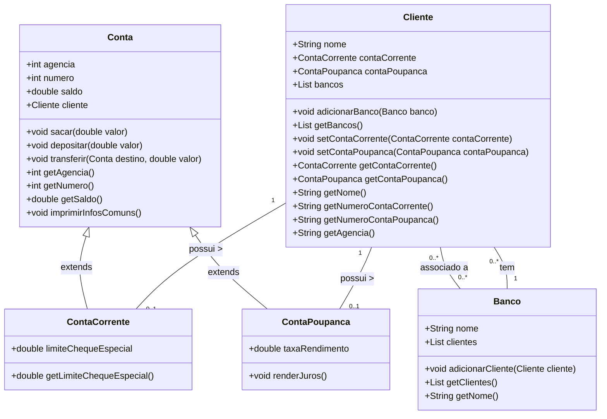

# Desafio de projeto Dio.me

Neste desafio, desenvolvemos uma solução orientada a objetos em Java para um sistema bancário simplificado. O sistema permite a gestão de clientes e suas contas, oferecendo dois tipos de contas: corrente e poupança. As principais funcionalidades incluem depósitos, saques e transferências entre contas.

* [Repositório no GitHub](https://github.com/falvojr/dio-live-20210802) (implementação de referência)

# Diagrama de Classes do Sistema Bancário

Aqui está o diagrama de classes que representa a estrutura do sistema bancário.

